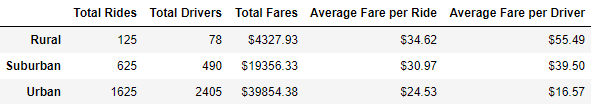

# PyBer Analysis

## Overview

### Purpose
We have been assigned to create a summary DataFrame of the ride-sharing data by city type and then create a multiple-line graph that shows the total weekly fares for each city type in order to show how the data differs between data types.

## Results

PyBer Summary DataFrame  

## Summary
